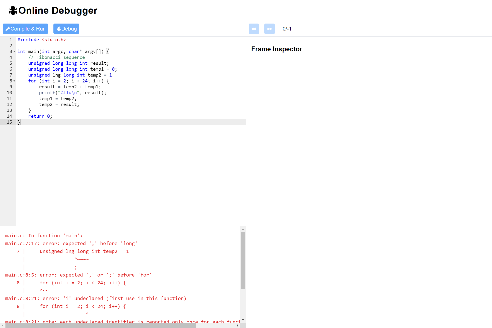
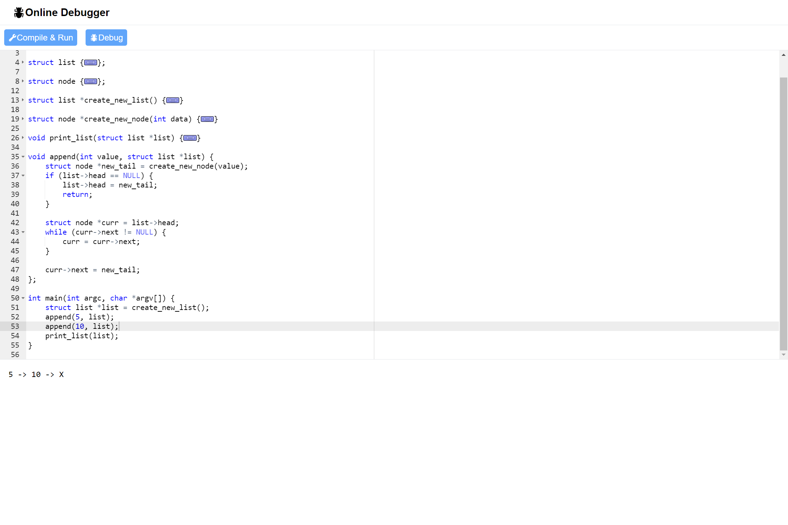

# Online Debugger

## About

The Online Debugger is a web application where users can edit C code, and it can compile and debug their code using GCC + GDB. THe users can read stdout from the console and they can also view the states of frame variables at each line of execution.

The frontend is built with Vite, React, Typescript and Tailwind CSS. `react-ace` is used for the code editor

The backend API server is built with Express, Typescript.

Docker is used to containerize the backend such that the backend can run the C compiler `gcc` and the C debugger `gdb` as a subprocess in node.  

In order to automate debugging, a Python script is used to create a JSON file representing the program frame states at each line of execution. The Python script can be found in [`/server/code/debug.py`](server/code/debug.py)

## Running

### Prerequisites
Ensure you have the following software:

-   Docker and docker-compose

### Instructions

-   `git clone` the repository
-   Run `docker-compose up --build`. The frontend should be visible on port `3000` and the backend should be visible on port `8000`
