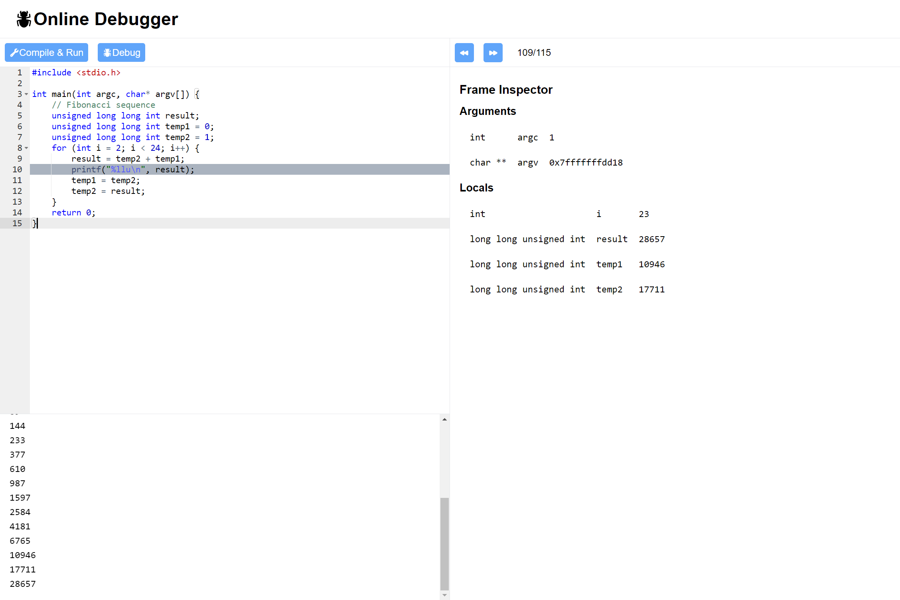

# Online Debugger

## About

The online debugger is a simple web app that reads in user C code, compiles it and displays the stdout. The ability to debug programs with GDB is a WIP.

The frontend is built with Vite, React + Typescript and Tailwind CSS. `react-ace` is used for the code editor
The backend is build with Express + Typescript

## Backend: Code execution API

The backend express route `/compile` takes in the user C code, writes it to a file and compiles it.

With code execution, security is a large concern since malicious user code can potentially shut down the entire server. To sandbox code execution and prevent this issue, node creates a child process which starts a docker container to execute code. Memory and time limits can be specified for the docker container to combat against malicious user C code.

Since the entire project is dockerised, we are esentially running docker in docker (The node express server runs in a docker container, and the server must start new docker containers for code execution). This is achieved by mounting the docker socket when the container for the express server is started (See `docker-compose.yml`)

## Setup

### Prerequisites

-   Docker and docker-compose

### Instructions

-   Clone the repository
-   `cd` into the `server` of the project directory and run `echo "HOST_DIR=$(pwd)"`. (Because we achieve docker in docker by mounting the docker socket, the host's docker daemon is used. Thus, if we want to mount a volume in docker in docker, we have to reference the host directory)
-   `cd` back up into the project root and run `docker-compose up --build`
